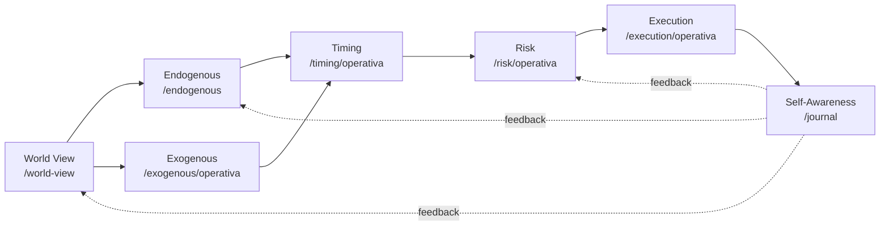
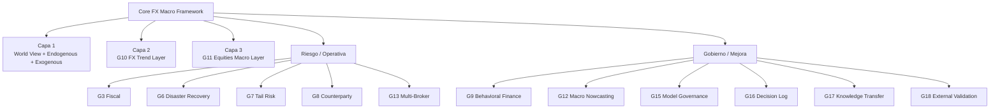

# Polaris App Sitemap

Esquema visual de la aplicacion: rutas, areas funcionales y modulos.

```mermaid
flowchart TD
  APP["Polaris App"]

  APP --> PUBLIC["Publico"]
  PUBLIC --> LOGIN["/login<br/>Login"]

  APP --> PROTECTED["Area protegida"]
  PROTECTED --> HUB["Hub"]
  PROTECTED --> ANALYSIS["Analisis Macro"]
  PROTECTED --> EXECUTION["Ejecucion, Riesgo y Continuidad"]
  PROTECTED --> LEARNING["Aprendizaje, Gobierno y Validacion"]
  PROTECTED --> SETTINGS["/settings<br/>Settings"]

  APP --> ADMIN["Admin / Data"]

  HUB --> ROOT["/<br/>Redirect a /dashboard"]
  HUB --> DASH["/dashboard<br/>Dashboard de modulos"]

  ANALYSIS --> GENERAL["/general<br/>Pais en una pantalla"]
  ANALYSIS --> WV["/world-view<br/>World View"]
  ANALYSIS --> ENDO["/endogenous<br/>Endogenous Drivers"]
  ANALYSIS --> INPUTS["/model-inputs<br/>Model Inputs"]
  ANALYSIS --> ZSCORES["/endogenous/zscores<br/>Z-Scores"]
  ANALYSIS --> BETAS["/endogenous/betas<br/>Betas"]
  ANALYSIS --> EXO["/exogenous/operativa<br/>Exogenous Drivers"]
  ANALYSIS --> EM["/emerging-markets<br/>Emerging Markets"]
  ANALYSIS --> TRADE["/trade<br/>Global Trade Monitor"]
  ANALYSIS --> G10["/fx-trend-layer<br/>G10 FX Trend Layer"]
  ANALYSIS --> G11["/equities-macro-layer<br/>G11 Equities Macro Layer"]
  ANALYSIS --> G12["/macro-nowcasting<br/>G12 Macro Nowcasting"]

  EXECUTION --> TIMING["/timing/operativa<br/>Timing"]
  EXECUTION --> RISK["/risk/operativa<br/>Risk Management"]
  EXECUTION --> EXEC["/execution/operativa<br/>Execution & Costs"]
  EXECUTION --> G3["/fiscal<br/>G3 Modulo Fiscal"]
  EXECUTION --> G6["/disaster-recovery<br/>G6 Disaster Recovery"]
  EXECUTION --> G7["/tail-risk<br/>G7 Hedging / Tail Risk"]
  EXECUTION --> G8["/counterparty-risk<br/>G8 Counterparty Risk"]
  EXECUTION --> G13["/multi-broker<br/>G13 Multi-Broker"]

  LEARNING --> JOURNAL["/journal<br/>Trade Journal"]
  LEARNING --> PERF["/performance<br/>Performance"]
  LEARNING --> BACKTEST["/backtest<br/>Backtest"]
  LEARNING --> SCENARIOS["/scenario-library<br/>Scenario Library"]
  LEARNING --> CAPITAL["/capital-allocation<br/>Capital Allocation"]
  LEARNING --> G9["/behavioral-finance<br/>G9 Behavioral Finance"]
  LEARNING --> G15["/model-governance<br/>G15 Model Governance"]
  LEARNING --> G16["/decision-log<br/>G16 Decision Log"]
  LEARNING --> G17["/knowledge-transfer<br/>G17 Knowledge Transfer"]
  LEARNING --> G18["/external-validation<br/>G18 External Validation"]

  ADMIN --> ADMIN_PAGE["/admin<br/>Admin Panel"]
  ADMIN --> DATA["/data<br/>Data Hub"]
  DATA --> RAW["/data/raw<br/>Raw Data"]
  DATA --> COVERAGE["/data/coverage-matrix<br/>Coverage Matrix"]
  DATA --> HISTORY["/data/history<br/>History"]
  DATA --> HISTORY_DETAIL["/data/history/:sourceId<br/>History Series"]
  DATA --> CALENDAR["/data/economic-calendar<br/>Economic Calendar"]
  DATA --> NOTIFICATIONS["/data/notifications<br/>Notifications"]
```



## Arbol De Navegacion

```text
Polaris App
|
+-- Publico
|   `-- /login                         Login
|
+-- Protegido
|   |
|   +-- Hub
|   |   +-- /                           Redirect a /dashboard
|   |   +-- /dashboard                  Dashboard de modulos
|   |   `-- /settings                   Settings
|   |
|   +-- Analisis Macro
|   |   +-- /general                    Pais en una pantalla
|   |   +-- /world-view                 World View
|   |   +-- /endogenous                 Endogenous Drivers
|   |   +-- /model-inputs               Model Inputs
|   |   +-- /endogenous/zscores         Z-Scores
|   |   +-- /endogenous/betas           Betas
|   |   +-- /exogenous/operativa        Exogenous Drivers
|   |   +-- /emerging-markets           Emerging Markets
|   |   +-- /trade                      Global Trade Monitor
|   |   +-- /fx-trend-layer             G10 FX Trend Layer
|   |   +-- /equities-macro-layer       G11 Equities Macro Layer
|   |   `-- /macro-nowcasting           G12 Macro Nowcasting Avanzado
|   |
|   +-- Ejecucion, Riesgo y Continuidad
|   |   +-- /timing/operativa           Timing
|   |   +-- /risk/operativa             Risk Management
|   |   +-- /execution/operativa        Execution & Costs
|   |   +-- /fiscal                     G3 Modulo Fiscal
|   |   +-- /disaster-recovery          G6 Disaster Recovery / BCP
|   |   +-- /tail-risk                  G7 Hedging / Tail Risk
|   |   +-- /counterparty-risk          G8 Counterparty Risk
|   |   `-- /multi-broker               G13 Multi-Broker / Multi-Account
|   |
|   `-- Aprendizaje, Gobierno y Validacion
|       +-- /journal                    Trade Journal
|       +-- /performance                Performance
|       +-- /backtest                   Backtest
|       +-- /scenario-library           Scenario Library
|       +-- /capital-allocation         Capital Allocation
|       +-- /behavioral-finance         G9 Behavioral Finance
|       +-- /model-governance           G15 Model Governance / Audit Trail
|       +-- /decision-log               G16 Decision Log estrategico
|       +-- /knowledge-transfer         G17 Knowledge Transfer Protocol
|       `-- /external-validation        G18 External Validation Framework
|
`-- Admin / Data
    +-- /admin                          Admin Panel
    `-- /data                           Data Hub
        +-- /data/raw                   Raw Data
        +-- /data/coverage-matrix       Coverage Matrix
        +-- /data/history               History
        +-- /data/history/:sourceId     History Series
        +-- /data/economic-calendar     Economic Calendar
        `-- /data/notifications         Notifications
```

## Flujo Principal Del Framework



## Capas Y Extensiones


